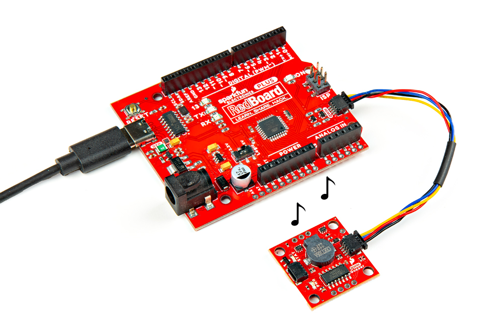
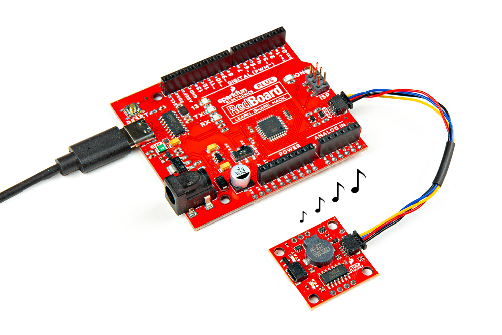
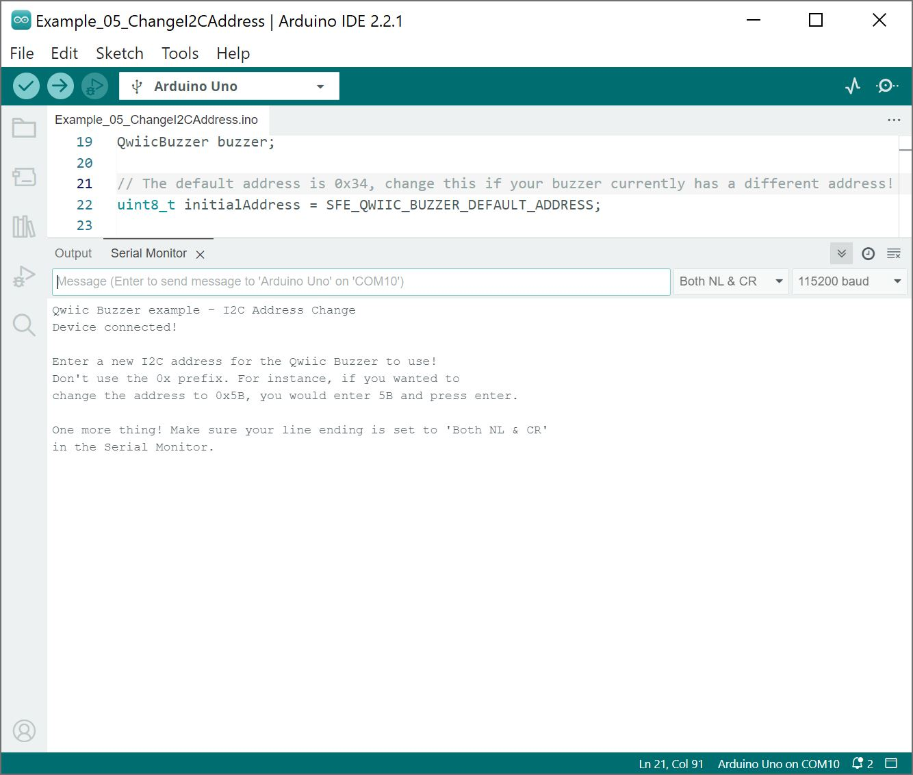
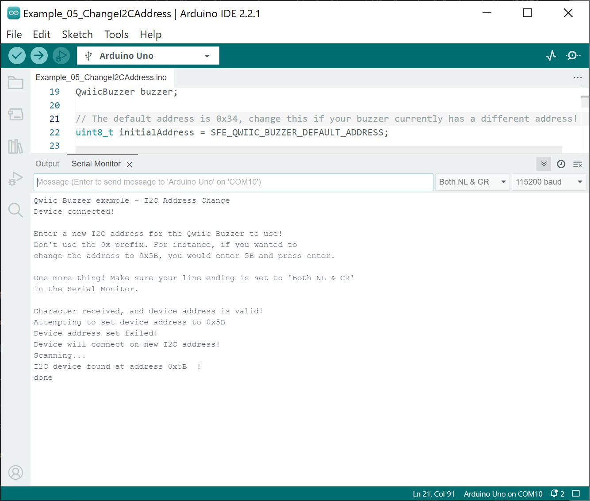
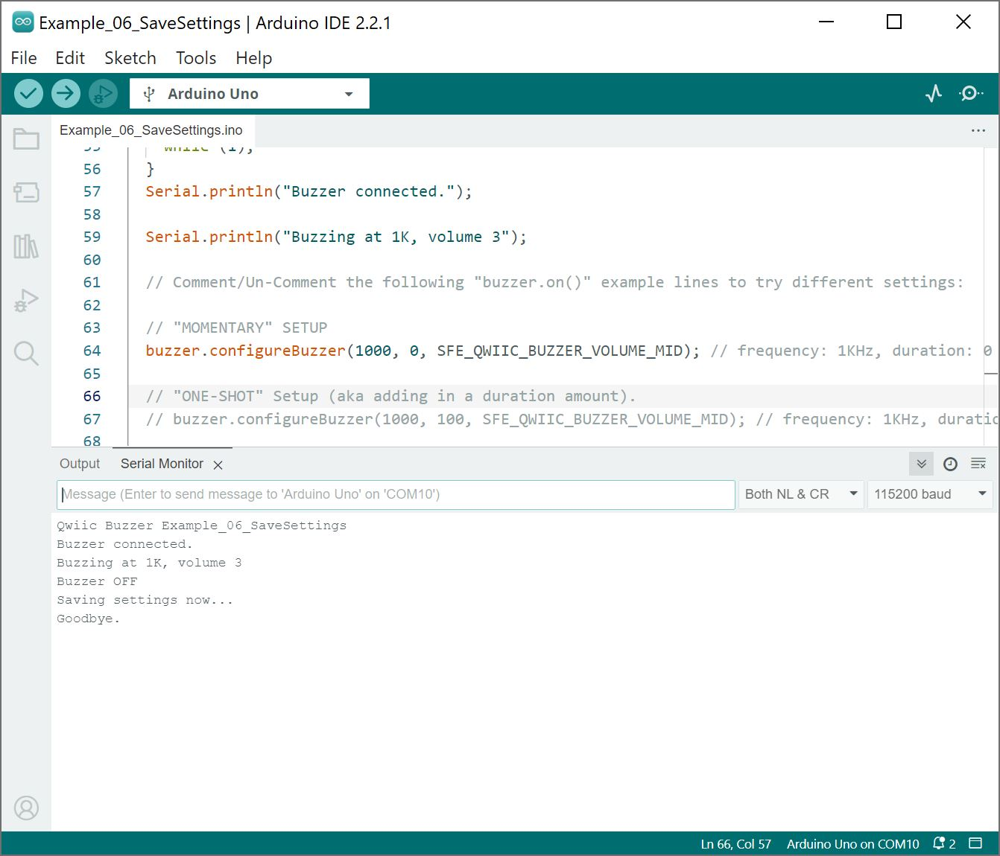
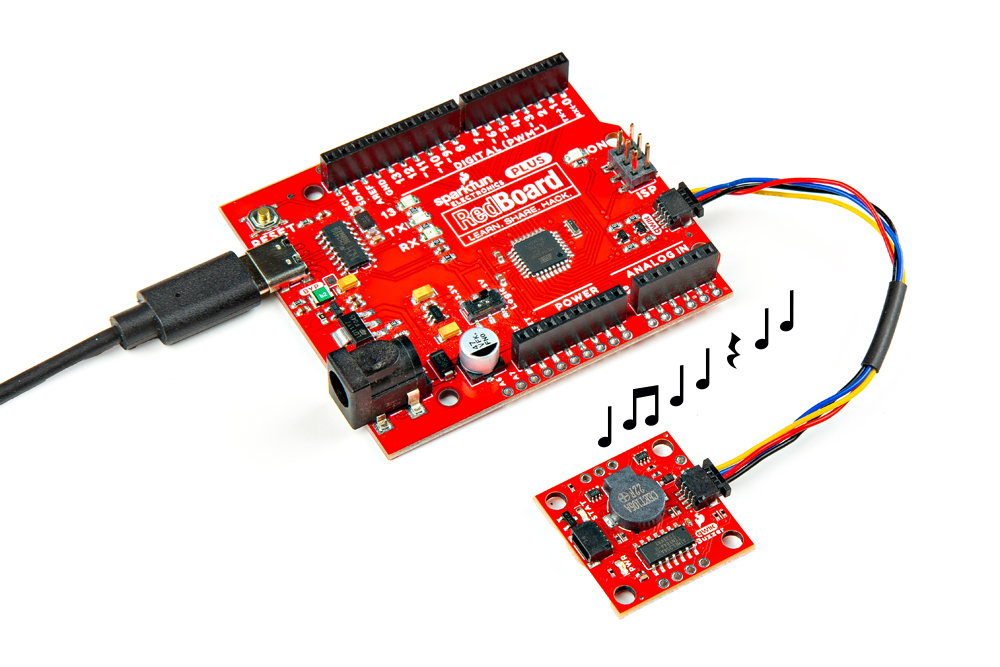
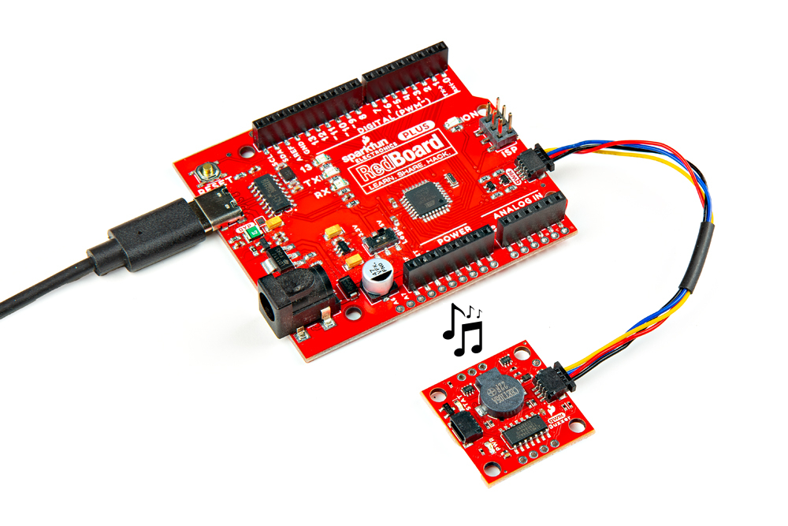
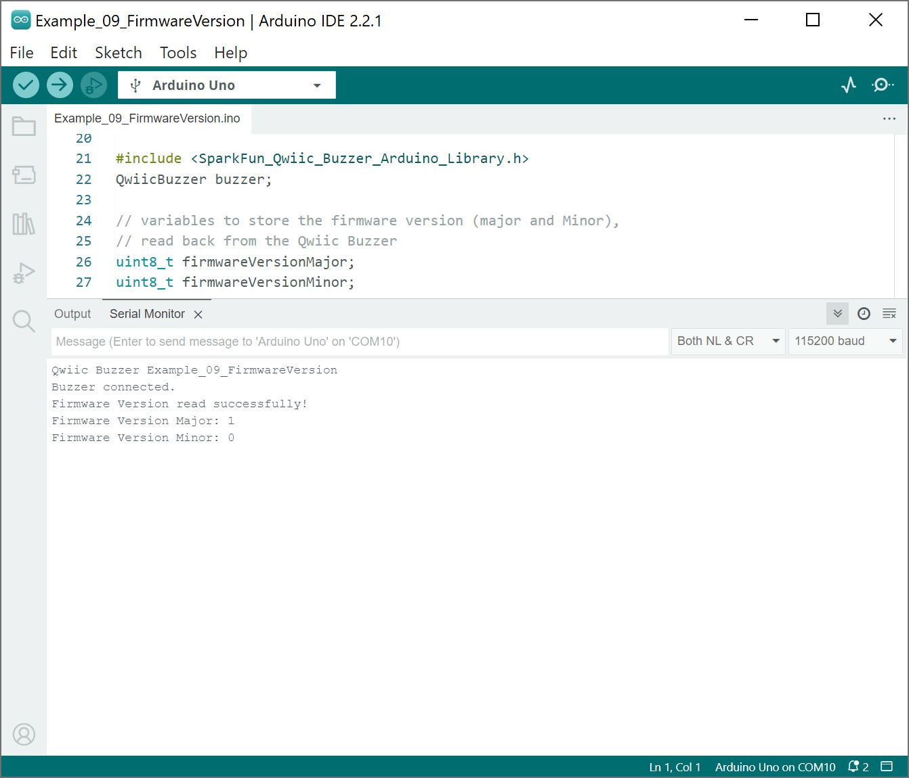
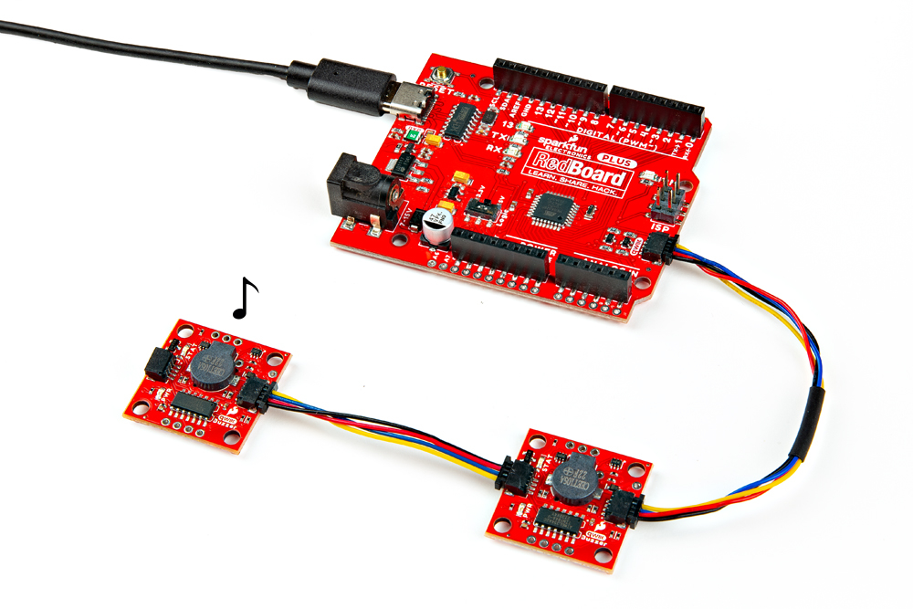

Now that we have our library installed, we can get started experimenting with the breakout board. For the scope of this tutorial, we will highlight the examples. From there we will be able to build our own custom code to integrate the Qwiic Buzzer into a project.

### Example 1: Buzz

In this example, we will show how to turn on and off the buzzer. This is similar to the classic "blink" sketch using an LED.

Open the example by heading to: **File** > **Examples** > **Qwiic Buzzer** > **Example_01_Buzz**. If you have not already, select your Board (in this case, the **Arduino Uno**), and associated COM port. Upload the code to the board. You should hear the Qwiic buzzer turning on and off every second.

  <table>
    <tr style="vertical-align:middle;">
     <td style="text-align: center; border: solid 1px #cccccc;" vertical-align: middle;"></td>
    </tr>
  </table>

### Example 2: Buzz Frequency

In this example, we will turn on and off the buzzer similar to the previous example. However, we will show how to adjust the frequency of the buzz every second.

Open the example by heading to: **File** > **Examples** > **Qwiic Buzzer** > **Example_02_Buzz_Frequency**. If you have not already, select your Board (in this case, the **Arduino Uno**), and associated COM port. Upload the code to the board.

  <table>
    <tr style="vertical-align:middle;">
     <td style="text-align: center; border: solid 1px #cccccc;" vertical-align: middle;"></td>
    </tr>
  </table>

 Try adjusting the frequency between values around `31` to `11000` to get the desired sound or `0` for a "rest." Of course, `buzzer.configureBuzzer()` also accepts [macros that were originally defined for pitches.h](https://github.com/sparkfun/SparkFun_Qwiic_Buzzer_Arduino_Library/blob/main/src/sfeQwiicBuzzerPitches.h) as well.

!!! note
    The first parameter that [`buzzer.configureBuzzer()](https://github.com/sparkfun/SparkFun_Qwiic_Buzzer_Arduino_Library/blob/b482bc7a6ee02bfbf9cffa0da09453260b7133a0/src/sfeQwiicBuzzer.cpp#L86) takes is a unsigned 16-bit integer. Technically, the function can accept values between 0 to 65,535. However, the human hearing range is between 20 to 20,000 Hz. Testing the Qwiic Buzzer, we found that the range is between around 30Hz to 11,000Hz. Outside of this range, you would just hear a click.

### Example 3: Buzz Duration

In this example, we will turn on and off the buzzer similar to the previous two examples. However, will adjust the duration as well.

Open the example by heading to: **File** > **Examples** > **Qwiic Buzzer** > **Example_03_Buzz_Duration**. If you have not already, select your Board (in this case, the **Arduino Uno**), and associated COM port. Upload the code to the board.

  <table>
    <tr style="vertical-align:middle;">
     <td style="text-align: center; border: solid 1px #cccccc;" vertical-align: middle;"></td>
    </tr>
  </table>

Try adjusting the second parameter for `buzzer.configureBuzzer()` duration in milliseconds. When the buzzer is on, you will want to be careful about the duration exceeding the `delay()` function. For example, if the duration is longer than the `delay()` and a second `buzzer.configureBuzzer()` is executed to make another note, the second `buzzer.configureBuzzer()` will "over-write" the previous note and play the second note.

!!! note
    The second parameter that [`buzzer.configureBuzzer()``](https://github.com/sparkfun/SparkFun_Qwiic_Buzzer_Arduino_Library/blob/b482bc7a6ee02bfbf9cffa0da09453260b7133a0/src/sfeQwiicBuzzer.cpp#L86) takes is also an unsigned 16-bit integer. The function can accept values between 0 to 65,535.

### Example 4: Buzz Volume

In this example, we will turn on and off the buzzer similar to the first example. However, we will toggle each transistor to increase the volume of the buzz.

Open the example by heading to: **File** > **Examples** > **Qwiic Buzzer** > **Example_04_Buzz_Volume**. If you have not already, select your Board (in this case, the **Arduino Uno**), and associated COM port. Upload the code to the board.

  <table>
    <tr style="vertical-align:middle;">
     <td style="text-align: center; border: solid 1px #cccccc;" vertical-align: middle;"></td>
    </tr>
  </table>

Notice that the example code uses predefined macros to control each of the transistors: `SFE_QWIIC_BUZZER_VOLUME_MIN`, `SFE_QWIIC_BUZZER_VOLUME_LOW`, `SFE_QWIIC_BUZZER_VOLUME_MID`, `SFE_QWIIC_BUZZER_VOLUME_MAX`. To turn off all the transistors, you would use `SFE_QWIIC_BUZZER_VOLUME_OFF`. For users that are using a custom resistor or potentiometer, you will need to use the `SFE_QWIIC_BUZZER_VOLUME_MIN`. Just make sure to cut the jumper labeled as `JP1`.

### Example 5: Change I2C Address

In this example, we will change the default address of the buzzer from **0x34** to a different value between ranging from **0x08** and **0x77**.

Open the example by heading to: **File** > **Examples** > **Qwiic Buzzer** > **Example_05_Change_I2C_Address**. If you have not already, select your Board (in this case, the **Arduino Uno**), and associated COM port. Upload the code to the board.

After uploading code, open the [Arduino Serial Monitor](https://learn.sparkfun.com/tutorials/terminal-basics/all#arduino-serial-monitor-windows-mac-linux) and set it to **115200** baud. You will also need to specify the line ending by setting it to: `Both NL & CR`. You will find this option to the left of the drop down menu for the baud rate.

  <table>
    <tr style="vertical-align:middle;">
     <td style="text-align: center; border: solid 1px #cccccc;" vertical-align: middle;"></td>
    </tr>
  </table>

Send a new [hexadecimal](https://learn.sparkfun.com/tutorials/hexadecimal/all) address ranging from **0x08** to  **0x77**, but without the prefix **0x**. Let's follow the message that was output to the Arduino Serial Monitor by typing <kbd>5B</kbd> and hitting the <kbd>ENTER</kbd> button.

  <table>
    <tr style="vertical-align:middle;">
     <td style="text-align: center; border: solid 1px #cccccc;" vertical-align: middle;"></td>
    </tr>
  </table>

Once the address is changed, the example code will begin to search for any addresses on the I2C bus. You should be able to see the new address of the Qwiic Buzzer. Now that we have changed address, try looking at example 10 to see the how to connect Qwiic Buzzer with a new address.

### Example 6: Save Settings

In this example, we will show how to save settings to the buzzer. We will configure the buzzer, make a buzz, and save the settings to memory. Every time we configure the Qwiic Buzzer's characteristics (frequency, duration, or volume), the buzzer will continue to play a buzz with the same settings until we send the **.configureBuzzer()** function different values or when power is cycled.

Open the example by heading to: **File** > **Examples** > **Qwiic Buzzer** > **Example_06_SaveSettings**. If you have not already, select your Board (in this case, the **Arduino Uno**), and associated COM port. Upload the code to the board.

  <table>
    <tr style="vertical-align:middle;">
     <td style="text-align: center; border: solid 1px #cccccc;" vertical-align: middle;"></td>
    </tr>
  </table>

Power cycle the Qwiic Buzzer. Grab a M/M jumper wire. Connect one end to any ground pin (GND). When ready, connect the other end of the jumper wire to the trigger pin (TRIG). You should be able to hear the same sound every time the pin is pulled low whenever power is removed.

!!! note
    Pulling the trigger pin low as the board is initially powered up will factory reset the board.

### Example 7: Buzz Melody

In this example, we will play a melody once.

Open the example by heading to: **File** > **Examples** > **Qwiic Buzzer** > **Example_07_Melody**. If you have not already, select your Board (in this case, the **Arduino Uno**), and associated COM port. Upload the code to the board.

After uploading code, you should hear the melody play one time.

  <table>
    <tr style="vertical-align:middle;">
     <td style="text-align: center; border: solid 1px #cccccc;" vertical-align: middle;"></td>
    </tr>
  </table>

### Example 8: Sound Effects

In this example, we will play different sound effects once.

 Open the example by heading to: **File** > **Examples** > **Qwiic Buzzer** > **Example_08_Sound_Effects**. If you have not already, select your Board (in this case, the **Arduino Uno**), and associated COM port. Upload the code to the board.

 After uploading code, sit back and enjoy the sweet sound effects!

 

   <table>
     <tr style="vertical-align:middle;">
      <td style="text-align: center; border: solid 1px #cccccc;" vertical-align: middle;"></td>
     </tr>
   </table>
 

### Example 9: Firmware Version

In this example, we will check the firmware version that is flashed on the ATtiny84.

 Open the example by heading to: **File** > **Examples** > **Qwiic Buzzer** > **Example_09_FirmwareVersion**. If you have not already, select your Board (in this case, the **Arduino Uno**), and associated COM port. Upload the code to the board.

After uploading code, open the [Arduino Serial Monitor](https://learn.sparkfun.com/tutorials/terminal-basics/all#arduino-serial-monitor-windows-mac-linux) and set it to **115200** baud. You should be able to see the current firmware loaded on the Qwiic Buzzer's ATtiny84.

  <table>
    <tr style="vertical-align:middle;">
     <td style="text-align: center; border: solid 1px #cccccc;" vertical-align: middle;"></td>
    </tr>
  </table>

### Example 10: Buzz Multiple

In this example, we will show how to control two Qwiic Buzzers with different addresses. If you have not already, check out [example 5](../arduino_examples/#example-5-change-i2c-address) to change the address of one of the Qwiic Buzzers. This example expects two buzzers set to these unique I2C addresses: **0x34** and **0x5B**.

 Open the example by heading to: **File** > **Examples** > **Qwiic Buzzer** > **Example_10_Buzz_Multiple**. If you have not already, select your Board (in this case, the **Arduino Uno**), and associated COM port. Upload the code to the board.

 Once the code has been uploaded, the buzzer with default address will buzz first. The second buzzer with the other address will make a buzz shortly after before the code loops again.

 

   <table>
     <tr style="vertical-align:middle;">
      <td style="text-align: center; border: solid 1px #cccccc;" vertical-align: middle;"></td>
      <td style="text-align: center; border: solid 1px #cccccc;" vertical-align: middle;"></td>
     </tr>
   </table>
 

