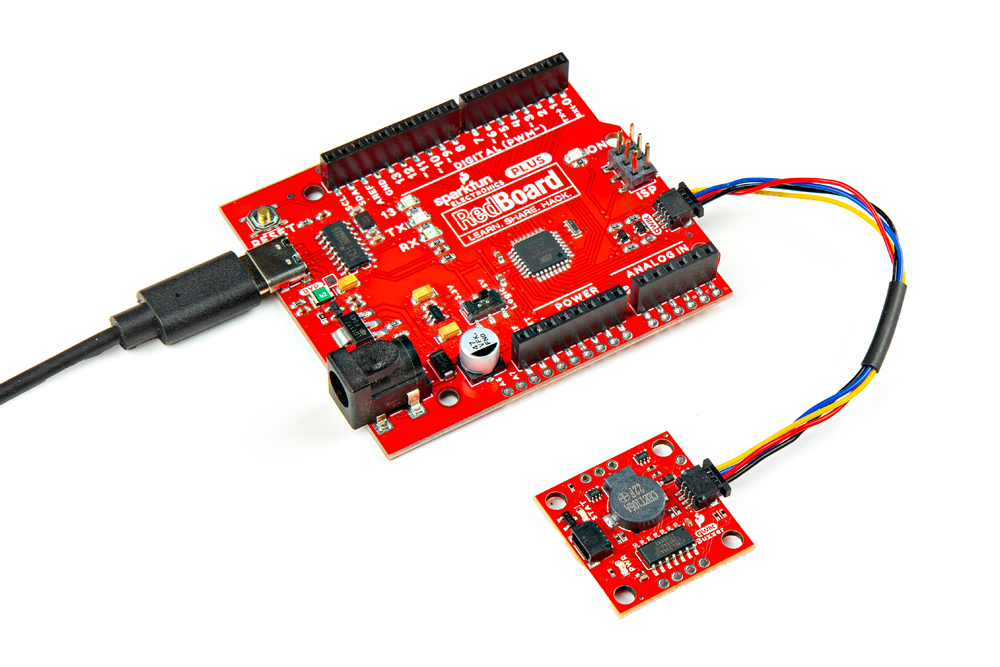
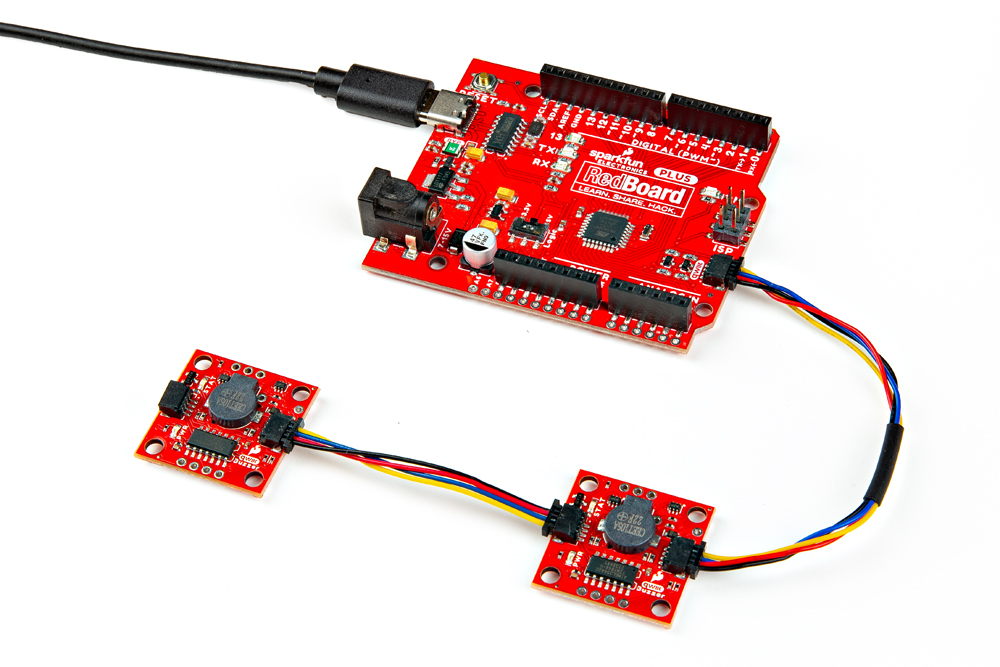
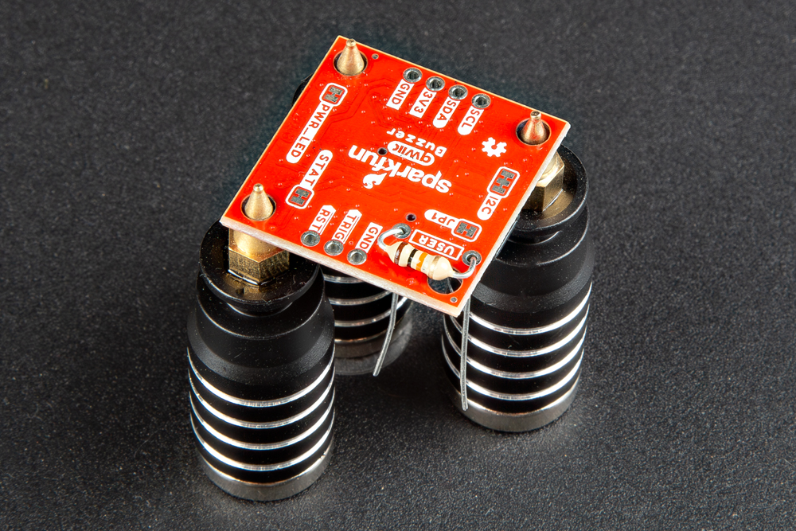
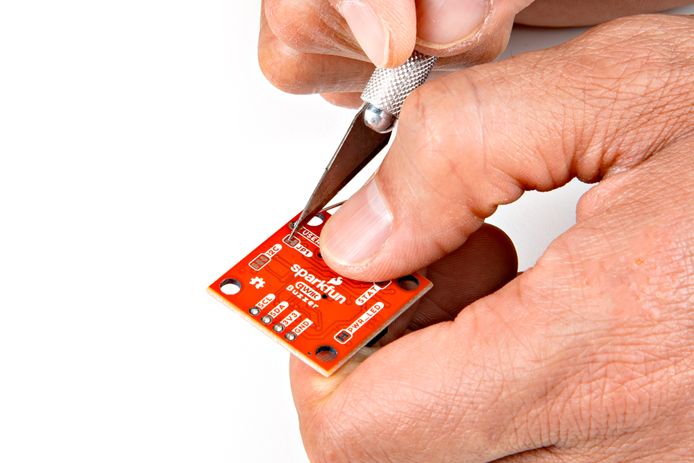
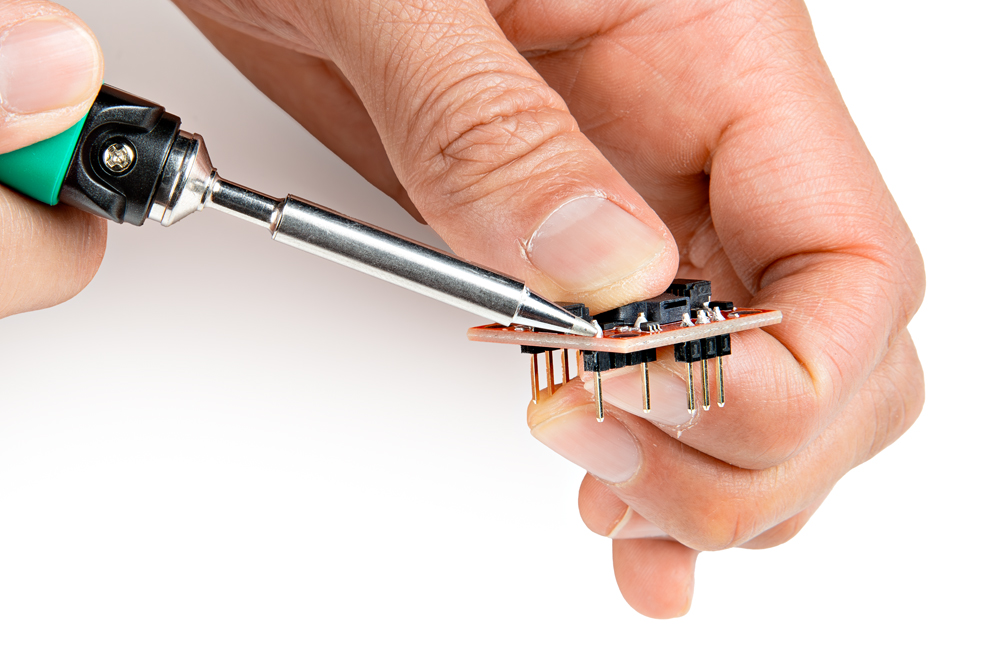
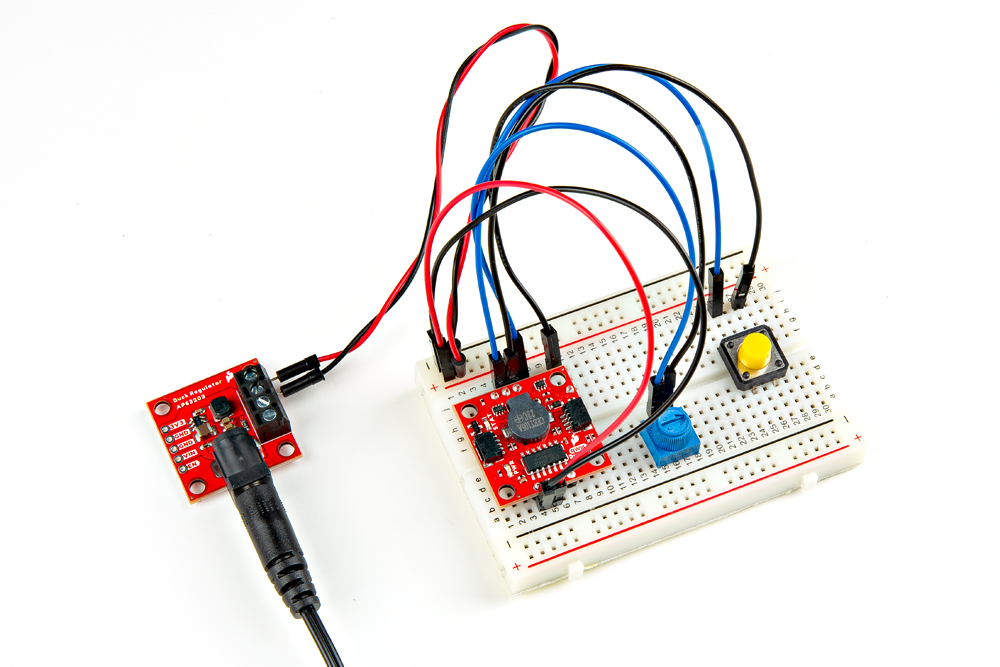
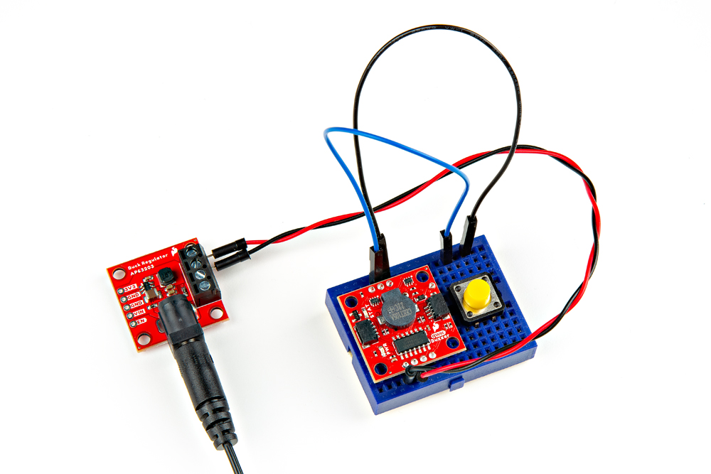

In this section, we'll go over how to connect the Qwiic Buzzer to an Arduino microcontroller.

### Connecting to the Qwiic I2C Port

Insert a Qwiic cable between the Qwiic Buzzer and your Arduino microcontroller. Then connect a USB cable between the Arduino microcontroller and your computer's COM port. In this case, we used the RedBoard Plus with ATmega328P.

  <table>
    <tr style="vertical-align:middle;">
     <td style="text-align: center; border: solid 1px #cccccc;" vertical-align: middle;"></td>
    </tr>
    <tr style="vertical-align:middle;">
     <td style="text-align: center; border: solid 1px #cccccc;" vertical-align: middle;"><i>RedBoard ATmega328P Programmed with Arduino Connected to Qwiic Buzzer</i></td>
    </tr>
  </table>

With the Qwiic Buzzer, you can daisy chain more than one buzzer! Typically on an Arduino, you could only use the [`tone()` function](https://www.arduino.cc/reference/en/language/functions/advanced-io/tone/) with one buzzer at a time and the function could also interfere with other PWM output pins as well. Controlling the Qwiic Buzzer through I2C allows you to play multiple buzzers simultaneously. Just make sure to configure the address of the buzzer and make another instance of any additional buzzer in the code should you decide to control each buzzer separately.

  <table>
    <tr style="vertical-align:middle;">
     <td style="text-align: center; border: solid 1px #cccccc;" vertical-align: middle;"></td>
    </tr>
    <tr style="vertical-align:middle;">
     <td style="text-align: center; border: solid 1px #cccccc;" vertical-align: middle;"><i>RedBoard ATmega328P Programmed with Arduino Connected Two Qwiic Buzzers</i></td>
    </tr>
  </table>

!!! note
    When daisy chaining both boards, you can control both simultaneously when using the same address.

### Connecting via PTH

For temporary connections to the PTHs on the edge of the board, you could use IC hooks to test out the pins. However, you'll need to solder headers or wires of your choice to the board for a secure connection. You can choose between a combination of [header pins and jumper wires](https://learn.sparkfun.com/tutorials/how-to-solder-through-hole-soldering/all), or [stripping wire and soldering the wire](https://learn.sparkfun.com/tutorials/working-with-wire/all) directly to the board.

-   <a href="https://learn.sparkfun.com/tutorials/how-to-solder-through-hole-soldering/all">
      <figure markdown>
        
      </figure>
    </a>

    ---

    <a href="https://learn.sparkfun.com/tutorials/how-to-solder-through-hole-soldering/all">
      <b>How to Solder: Through Hole Soldering</b>
    </a>
<!-- ----------WHITE SPACE BETWEEN GRID CARDS---------- -->

-   <a href="https://learn.sparkfun.com/tutorials/working-with-wire/all">
      <figure markdown>
        
      </figure>
    </a>

    ---

    <a href="https://learn.sparkfun.com/tutorials/working-with-wire/all">
      <b>Working with Wire</b>
    </a>
<!-- ----------WHITE SPACE BETWEEN GRID CARDS---------- -->

For the custom resistor, you will need to bend the resistor's terminals and insert it into the PTHs where it says USER. You can solder the terminals from the bottom or top. Depending on the size of the resistor, the resistor may not sit flush against the board. You may need to bend the terminals in and push the resistor to the side. The image shown below on the left shows a 1/4 watt resistor with thick leads not sitting flush against the footprint. For those inserting the  resistor from the bottom, make sure to have enough room to cut the jumper labeled as JP1 before soldering the resistor's terminals. Of course, make sure to cut off the excess terminals after soldering the resistor and carefully clean the board.

  <table>
    <tr style="vertical-align:middle;">
     <td style="text-align: center; border: solid 1px #cccccc;" vertical-align: middle;"></td>
     <td style="text-align: center; border: solid 1px #cccccc;" vertical-align: middle;"></td>
    </tr>
    <tr style="vertical-align:middle;">
      <td style="text-align: center; border: solid 1px #cccccc;" vertical-align: middle;"><i>Cut JP1 Jumper</i></td>
      <td style="text-align: center; border: solid 1px #cccccc;" vertical-align: middle;"><i>Soldering Custom Resistor</i></td>
    </tr>
  </table>

!!! warning
    When cleaning the board, make sure that the buzzer is not submerged under water.

You can also carefully pull the two inner pins out of a 1x4 standard male header pin using pliers, solder the remaining two into the board, and insert the Qwiic Buzzerinto a breadboard. This is useful for those interested in using a 10k&ohm; potentiometer to control the volume.

  <table>
    <tr style="vertical-align:middle;">
     <td style="text-align: center; border: solid 1px #cccccc;" vertical-align: middle;"></td>
     <td style="text-align: center; border: solid 1px #cccccc;" vertical-align: middle;"></td>
    </tr>
    <tr style="vertical-align:middle;">
      <td style="text-align: center; border: solid 1px #cccccc;" vertical-align: middle;"><i>Soldering 1x4 Header Pins (with Center Pins Pulled Out)</i></td>
      <td style="text-align: center; border: solid 1px #cccccc;" vertical-align: middle;"><i>Soldering Custom Resistor</i></td>
    </tr>
  </table>

!!! note
    By sacrificing two inner male pins from the 1x4 header, the remaining plastic spacers will help keep the single square pins in place as you solder them to the board.

### Stand-Alone Mode

For users that simply need to trigger a beeping noise, all you need to do is power the Qwiic Buzzer and ground the trigger pin! If you have a 3.3V voltage regulator, simply connect 3.3V and ground to the Qwiic Buzzer. Then connect the <b>TRIG</b> pin to GND using either a momentary button or jumper wire.

    <table>
        <tr>
            <th style="text-align: center; border: solid 1px #cccccc;">SparkFun Buck Regulator Breakout 3.3V (AP63203) Pins
            </th>
            <th style="text-align: center; border: solid 1px #cccccc;">Button
            </th>
            <th style="text-align: center; border: solid 1px #cccccc;">Qwiic Buzzer Pins
            </th>
        </tr>
        <tr style="vertical-align:middle;">
            <td style="text-align: center; border: solid 1px #cccccc;" bgcolor="#f2dede">3V3
            </td>
            <td style="text-align: center; border: solid 1px #cccccc;">
            </td>
            <td style="text-align: center; border: solid 1px #cccccc;" bgcolor="#f2dede">3V3
            </td>
        </tr>
        <tr style="vertical-align:middle;">        
            <td style="text-align: center; border: solid 1px #cccccc;" bgcolor="#DDDDDD">GND
            </td>
            <td style="text-align: center; border: solid 1px #cccccc;" bgcolor="#DDDDDD">Common
            </td>
            <td style="text-align: center; border: solid 1px #cccccc;" bgcolor="#DDDDDD">GND
            </td>
        </tr>
        <tr style="vertical-align:middle;">        
            <td style="text-align: center; border: solid 1px #cccccc;">
            </td>
            <td style="text-align: center; border: solid 1px #cccccc;" bgcolor="#fff3cd">Normally Open (NO)
            </td>
            <td style="text-align: center; border: solid 1px #cccccc;" bgcolor="#fff3cd">TRIG
            </td>
        </tr>
    </table>

  <table>
    <tr style="vertical-align:middle;">
     <td style="text-align: center; border: solid 1px #cccccc;" vertical-align: middle;"></td>
    </tr>
    <tr style="vertical-align:middle;">
     <td style="text-align: center; border: solid 1px #cccccc;" vertical-align: middle;"><i>Toggling Trigger Pin with a Button</i></td>
    </tr>
  </table>

    <table>
    <tr style="vertical-align:middle;">
            <th style="text-align: center; border: solid 1px #cccccc;">SparkFun Buck Regulator Breakout 3.3V (AP63203) Pins
            </th>
            <th style="text-align: center; border: solid 1px #cccccc;">Button
            </th>
            <th style="text-align: center; border: solid 1px #cccccc;">10k&ohm; Trim Pot
            </th>
            <th style="text-align: center; border: solid 1px #cccccc;">Qwiic Buzzer Pins
            </th>
        </tr>
        <tr style="vertical-align:middle;">
            <td style="text-align: center; border: solid 1px #cccccc;" bgcolor="#f2dede">3V3
            </td>
            <td style="text-align: center; border: solid 1px #cccccc;">
            </td>
            <td style="text-align: center; border: solid 1px #cccccc;" >
            </td>
            <td style="text-align: center; border: solid 1px #cccccc;" bgcolor="#f2dede">3V3
            </td>
        </tr>
        <tr style="vertical-align:middle;">     
            <td style="text-align: center; border: solid 1px #cccccc;" bgcolor="#DDDDDD">GND
            </td>
            <td style="text-align: center; border: solid 1px #cccccc;" bgcolor="#DDDDDD">Common
            </td>
            <td style="text-align: center; border: solid 1px #cccccc;">
            </td>
            <td style="text-align: center; border: solid 1px #cccccc;" bgcolor="#DDDDDD">GND
            </td>
        </tr>
        <tr style="vertical-align:middle;">        
            <td style="text-align: center; border: solid 1px #cccccc;">
            </td>
            <td style="text-align: center; border: solid 1px #cccccc;" bgcolor="#fff3cd">Normally Open (NO)
            </td>
            <td style="text-align: center; border: solid 1px #cccccc;">
            </td>
            <td style="text-align: center; border: solid 1px #cccccc;" bgcolor="#fff3cd">TRIG
            </td>
        </tr>
        <tr style="vertical-align:middle;">        
            <td style="text-align: center; border: solid 1px #cccccc;">
            </td>
            <td style="text-align: center; border: solid 1px #cccccc;">
            </td>
            <td style="text-align: center; border: solid 1px #cccccc;" bgcolor="#cce5ff">Pin 2 (i.e. Center Pin)
            </td>
            <td style="text-align: center; border: solid 1px #cccccc;" bgcolor="#cce5ff">USER PTH 1 (The PTH closest to the Buzzer)
            </td>
        </tr>
        <tr style="vertical-align:middle;">       
            <td style="text-align: center; border: solid 1px #cccccc;">
            </td>
            <td style="text-align: center; border: solid 1px #cccccc;">
            </td>
            <td style="text-align: center; border: solid 1px #cccccc;" bgcolor="#d4edda">Pin 1 or 3
            </td>
            <td style="text-align: center; border: solid 1px #cccccc;" bgcolor="#d4edda">USER PTH 2 (The PTH closest to the Qwiic Connector)
            </td>
        </tr>
    </table>

  <table>
    <tr style="vertical-align:middle;">
     <td style="text-align: center; border: solid 1px #cccccc;" vertical-align: middle;"></td>
    </tr>
    <tr style="vertical-align:middle;">
     <td style="text-align: center; border: solid 1px #cccccc;" vertical-align: middle;"><i>Toggling Trigger Pin with a Button While Controlling Volume with 10k&ohm; Trimpot</i></td>
    </tr>
  </table>

