In this section, we will highlight the hardware and pins that are broken out on the SparkFun Qwiic Buzzer.

  <table>
    <tr style="vertical-align:middle;">
     <td style="text-align: center; border: solid 1px #cccccc;" vertical-align: middle;"><a href="../assets/img/BOB-24474-Qwiic-Buzzer_Top_View.jpg">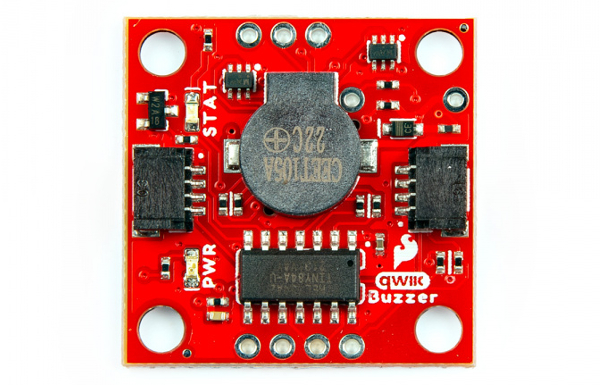</a></td>
     <td style="text-align: center; border: solid 1px #cccccc;" vertical-align: middle;"><a href="../assets/img/BOB-24474-Qwiic-Buzzer_Bottom_View.jpg">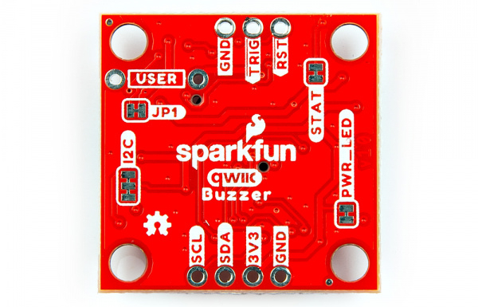</a></td>
    </tr>
    <tr style="vertical-align:middle;">
     <td style="text-align: center; border: solid 1px #cccccc;" vertical-align: middle;"><i>Top View</i></td>
     <td style="text-align: center; border: solid 1px #cccccc;" vertical-align: middle;"><i>Bottom View</i></td>
    </tr>
  </table>

### Power

There are a few power-related nets broken out to Qwiic connectors and through hole pads. The recommended input voltage is **3.3V**. The logic levels for the Qwiic Buzzer is **3.3V**.

* **3V3** &mdash; This connects to the 3.3V net. This net should only be provided with a clean 3.3V power signal. This is also connected to the Qwiic connectors.
* **GND** &mdash; Of course, is the common, ground voltage (0V reference) for the system.

  <table>
    <tr style="vertical-align:middle;">
     <td style="text-align: center; border: solid 1px #cccccc;" vertical-align: middle;"><a href="../assets/img/BOB-24474-Qwiic-Buzzer_Power_Top_View.jpg">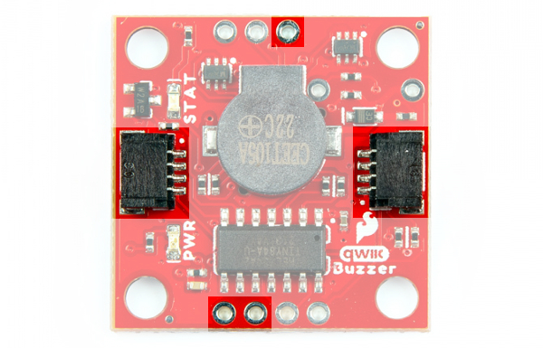</a></td>
     <td style="text-align: center; border: solid 1px #cccccc;" vertical-align: middle;"><a href="../assets/img/BOB-24474-Qwiic-Buzzer_Power_Bottom_View.jpg">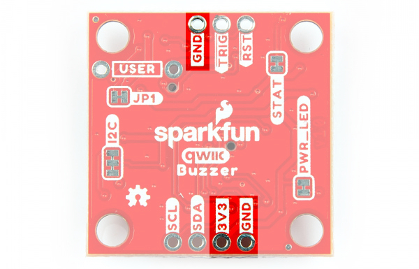</a></td>
    </tr>
    <tr style="vertical-align:middle;">
     <td style="text-align: center; border: solid 1px #cccccc;" vertical-align: middle;"><i>Power Nets Highlighted (Top View)</i></td>
     <td style="text-align: center; border: solid 1px #cccccc;" vertical-align: middle;"><i>Power Nets Highlighted (Bottom View)</i></td>
    </tr>
  </table>

!!! note
    While the ATtiny84 microcontroller can handle a voltage between 1.1V to 5.5V, we recommend only using 3.3V due to the fact that the Qwiic port's I2C data lines use are typically interfacing with a 3.3V system.

### Buzzer

!!! note
    Interested in the difference between a magnetic and piezo buzzer? Check out the article from CUI Devices: "[Buzzer Basics - Technologies, Tones, and Drive Circuits](https://www.cuidevices.com/blog/buzzer-basics-technologies-tones-and-driving-circuits#magnetic-and-piezo-buzzers)".

The board would not be the Qwiic Buzzer without... a buzzer! The buzzer uses a small magnetic coil to vibrate a metal disc inside the plastic housing. By pulsating current through the coil at different rates, we can produce different frequencies (pitches) of sound.

  <table>
    <tr style="vertical-align:middle;">
      <td style="text-align: center; border: solid 1px #cccccc;" vertical-align: middle;"><a href="../assets/img/BOB-24474-Qwiic-Buzzer_Buzzer_Transistor_Diode.jpg">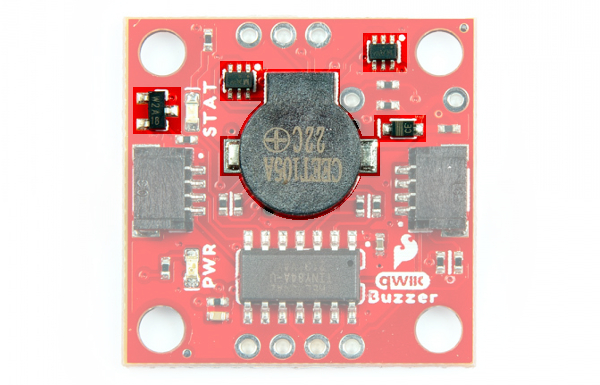</a></td>
    </tr>
    <tr style="vertical-align:middle;">
      <td style="text-align: center; border: solid 1px #cccccc;" vertical-align: middle;"><i>Buzzer Highlighted (Top View)</i></td>
    </tr>
  </table>

Power and control is applied to the buzzer with a set of BJTs. At full volume, it allows the full current of about ~95mA, which makes it _really_ loud. Typically, power and control is directly connected to microcontrollers GPIO, which limits the current to ~40mA. A [flyback diode](https://learn.sparkfun.com/tutorials/diodes/all#diode-applications) is included to discharge any energy remaining when the buzzer is shut off.

### ATtiny84

The brains of the Qwiic Buzzer users an ATtiny84. This IC comes pre-programmed with custom firmware designed to interact with the Arduino Library. The ATtiny84 accepts I2C reads and writes, interprets them, and creates sound by sending a PWM signal to the buzzer. The volume of the buzzer is typically controlled using a variable resistor like a potentiometer. However, four GPIOs, NPN transistors, and resistors are used to provide 7 levels of loudness.

  <table>
    <tr style="vertical-align:middle;">
     <td style="text-align: center; border: solid 1px #cccccc;" vertical-align: middle;"><a href="../assets/img/BOB-24474-Qwiic-Buzzer_ATtiny85_Microcontroller.jpg">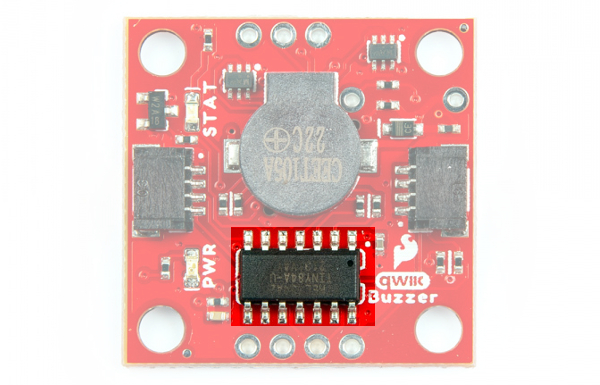</a></td>
    </tr>
    <tr style="vertical-align:middle;">
      <td style="text-align: center; border: solid 1px #cccccc;" vertical-align: middle;"><i>ATTiny84 Highlighted (Top View)</i></td>
    </tr>
  </table>

!!! note "Where's SPI?!?"
    This board was designed to control the buzzer via I2C. While you can access the SPI pins with the help of the Eagle schematic and board files (e.g. <b>TRIG</b> = POCI, SDA = PICO, and SCL = SCK), these pins are only used for advanced users and programing the AVR microcontroller using custom firmware. For more information about programming an ATtiny84, check out our [Tiny AVR Programmer Hookup Guide](https://learn.sparkfun.com/tutorials/tiny-avr-programmer-hookup-guide#introduction).

### Qwiic and I2C

There are two PTHs labeled **SDA** and **SCL** on one side of the board. These indicate the I2C data and clock lines and are connected to two 2.2k&ohm; pull-up resistors. We also conveniently added a GND and 3.3V pin on one side should you decide to daisy chain additional I2C devices to the PTH. Similarly, you can use either of the Qwiic connectors to provide power and send data through I2C. The [Qwiic ecosystem](https://www.sparkfun.com/qwiic) is made for fast prototyping by removing the need for soldering. All you need to do is plug a Qwiic cable into the Qwiic connector and voila!

* **SCL** &mdash; I2C clock
* **SDA** &mdash; I2C data

  <table>
    <tr style="vertical-align:middle;">
     <td style="text-align: center; border: solid 1px #cccccc;" vertical-align: middle;"><a href="../assets/img/BOB-24474-Qwiic-Buzzer_I2C_Top_View.jpg">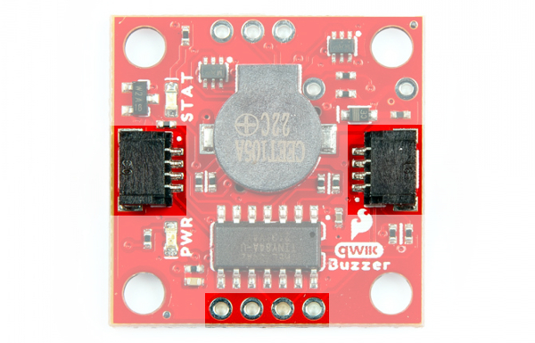</a></td>
     <td style="text-align: center; border: solid 1px #cccccc;" vertical-align: middle;"><a href="../assets/img/BOB-24474-Qwiic-Buzzer_I2C_Bottom_View.jpg">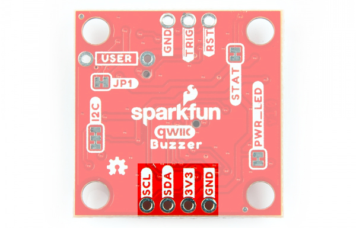</a></td>
    </tr>
    <tr style="vertical-align:middle;">
     <td style="text-align: center; border: solid 1px #cccccc;" vertical-align: middle;"><i>I2C PTHs Highlighted (Top View)</i></td>
     <td style="text-align: center; border: solid 1px #cccccc;" vertical-align: middle;"><i>Qwiic and I2C PTHs Highlighted (Bottom View)</i></td>
    </tr>
  </table>

The default I2C address for the Qwiic buzzer is **0x34**. This can also be software configured.

### Broken Out Pins

* <b>TRIG</b> &mdash; The trigger pin enables users to active the buzzer without an I2C whenever the pin is pulled low. This pin also has an alternative function. Pulling the trigger pin low as the board is initially powered up will factory reset the board.
* <b>RST</b> &mdash; The reset pin resets the ATTiny84 when the pin is pulled low.

  <table>
    <tr style="vertical-align:middle;">
     <td style="text-align: center; border: solid 1px #cccccc;" vertical-align: middle;"><a href="../assets/img/BOB-24474-Qwiic-Buzzer_Interrupt_Reset_Top_View.jpg">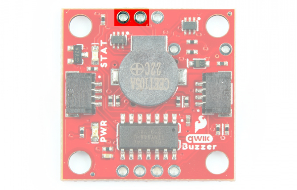</a></td>
     <td style="text-align: center; border: solid 1px #cccccc;" vertical-align: middle;"><a href="../assets/img/BOB-24474-Qwiic-Buzzer_Interrupt_Reset_Bottom_View.jpg">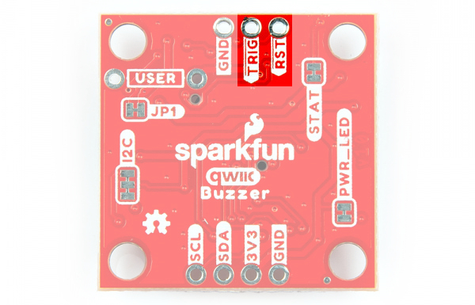</a></td>
    </tr>
    <tr style="vertical-align:middle;">
     <td style="text-align: center; border: solid 1px #cccccc;" vertical-align: middle;"><i>Trigger & Reset PTHs Highlighted (Top View)</i></td>
     <td style="text-align: center; border: solid 1px #cccccc;" vertical-align: middle;"><i>Trigger & Reset PTHs Highlighted (Bottom View)</i></td>
    </tr>
  </table>

### User Resistor

There is a footprint available for a PTH resistor. This is labeled as USER. For users interested in including a custom resistor to control the loudness of the buzzer, you can solder a PTH resistor to the two PTHs. Note that you would need to cut the jumper on the back of the board (labeled as JP1) if you are not using the onboard 2.2k&ohm; SMD resistor.

  <table>
    <tr style="vertical-align:middle;">
     <td style="text-align: center; border: solid 1px #cccccc;" vertical-align: middle;"><a href="../assets/img/BOB-24474-Qwiic-Buzzer_User_Resistor_Top_Volume_View.jpg">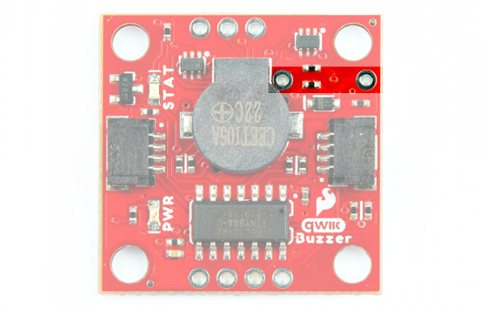</a></td>
     <td style="text-align: center; border: solid 1px #cccccc;" vertical-align: middle;"><a href="../assets/img/BOB-24474-Qwiic-Buzzer_User_Resistor_Bottom_Volume_View.jpg">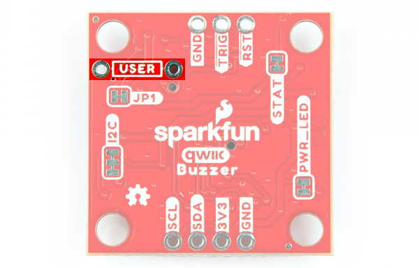</a></td>
    </tr>
    <tr style="vertical-align:middle;">
     <td style="text-align: center; border: solid 1px #cccccc;" vertical-align: middle;"><i>User Resistor PTHs Highlighted (Top View)</i></td>
     <td style="text-align: center; border: solid 1px #cccccc;" vertical-align: middle;"><i>User Resistor PTHs Highlighted (Bottom View)</i></td>
    </tr>
  </table>

### LEDs

The board includes the following status LEDs as indicated in the image below.

* **PWR** &mdash; The power LED lights up when the board is powered. This LED is connected the 3.3V net. This LED can be disabled with the PWR jumper on the bottom of the board.
* **STAT** &mdash; The status LED lights up whenever the buzzer is active. This adds a nice visual indicator whenever there is noise.

  <table>
    <tr style="vertical-align:middle;">
     <td style="text-align: center; border: solid 1px #cccccc;" vertical-align: middle;"><a href="../assets/img/BOB-24474-Qwiic-Buzzer_LEDs.jpg">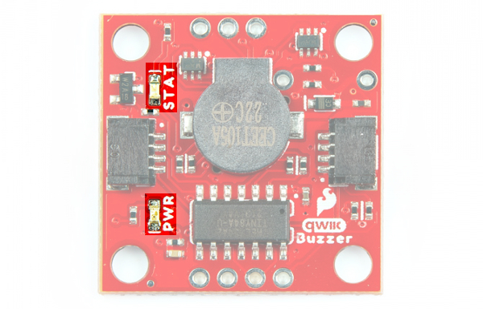</a></td>
    </tr>
    <tr style="vertical-align:middle;">
     <td style="text-align: center; border: solid 1px #cccccc;" vertical-align: middle;"><i>LEDs Highlighted (Top View)</i></td>
    </tr>
  </table>

### Jumpers

!!!note
    If this is your first time working with jumpers, check out the [How to Work with Jumper Pads and PCB Traces](https://learn.sparkfun.com/tutorials/how-to-work-with-jumper-pads-and-pcb-traces/all) tutorial for more information.

If you flip the board over, you will notice a few jumper pads.

* **PWR_LED** &mdash; The power LED will illuminate when 3.3V is available either over the Qwiic bus or the 3V3 pin. By default, this jumper is closed. Cut this jumper to disable the LED.
* **STAT** &mdash; The status LED will illuminate whenever the buzzer is making noise. By default, this jumper is closed. Cut this jumper to disable the LED.
* **I2C** &mdash; This three way jumper labeled **I2C** is connected to two pull-up resistors to the I2C data and clock lines. For users that have multiple Qwiic-enabled devices with pull-up resistors enabled, the parallel equivalent resistance will create too strong of a pull-up for the bus to operate correctly. As a general rule of thumb, [disable all but one pair of pull-up resistors](https://learn.sparkfun.com/tutorials/i2c/all#i2c-at-the-hardware-level) if multiple devices are connected to the bus.
* **JP1** &mdash; This jumper pad is available for users that want include a custom resistor to control the loudness of the buzzer. Cut this jumper to disconnect resistor R15. You will need to have a resistor populated for the USER PTH resistor.

  <table>
    <tr style="vertical-align:middle;">
     <td style="text-align: center; border: solid 1px #cccccc;" vertical-align: middle;"><a href="../assets/img/BOB-24474-Qwiic-Buzzer_Jumpers.jpg">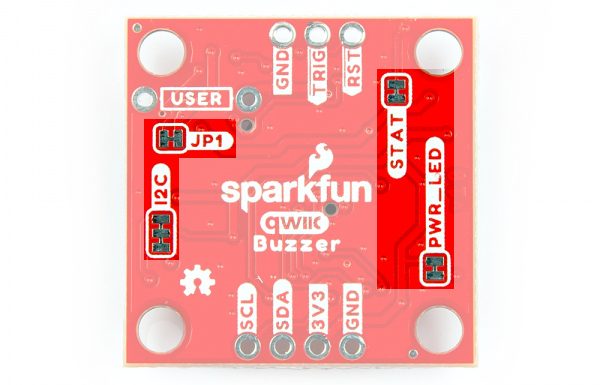</a></td>
    </tr>
    <tr style="vertical-align:middle;">
     <td style="text-align: center; border: solid 1px #cccccc;" vertical-align: middle;"><i>Jumpers Highlighted (Bottom View)</i></td>
    </tr>
  </table>

### Board Dimensions

The board uses the standard 1.0" x 1.0" (25.4mm x 25.4mm) Qwiic board. There are 4x mounting holes by each corner of the board.

  <table>
    <tr style="vertical-align:middle;">
     <td style="text-align: center; border: solid 1px #cccccc;" vertical-align: middle;"><a href="../assets/img/BOB-24474-Qwiic-Buzzer__Board_Dimensions.png">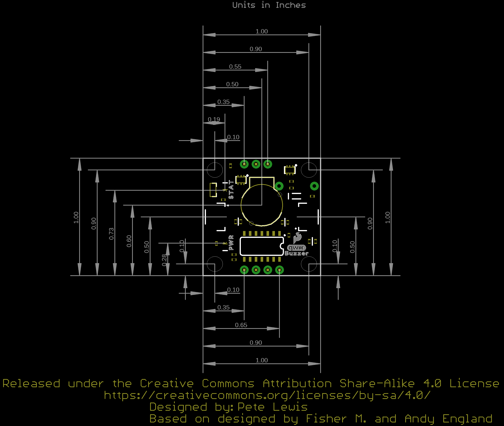</a></td>
    </tr>
    <tr style="vertical-align:middle;">
     <td style="text-align: center; border: solid 1px #cccccc;" vertical-align: middle;"><i>Board Dimensions</i></td>
    </tr>
  </table>

